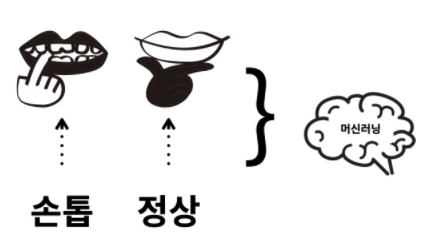
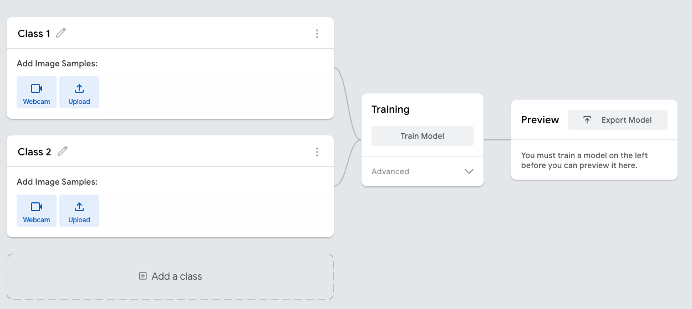

# 머신러닝1 - 1

## 머신러닝이란? 
- 결정 = 비교 + 선택
    - 크고 작음의 비교 등으로 무엇이 더 좋고 나쁜지 찾기 
    - 비교 해야할 특징이 너무 많거나, 너무 없거나, 수치화 하기 힘들땐?
    - 통계의 시대    

- 머신러닝은 두뇌를 더 두뇌 답게!

## 꿈과 궁리하는 습관
- 해결하고자 하는 문제! 가 있어야한다.
    - 그 해결하고자 하는 문제를 '습관'에 비추어 생각해보자!
    - 습관 -> 의지 -> 환경 -> 습관
    ```
    저는 손톱을 깨물었을 때, 저에게 그것을 알려줄 수 있는
    "환경"을 만들고 싶어졌습니다.

    이런 환경에 지속해서 노출되면
    천천히 습관을 새로 고침 할 수 있을 것 같습니다.

    ‘오랜 습관을 바꾸고 싶다’는 꿈이 생긴 것입니다.
    ```

- 일 = 꿈 + 능력 
    - 원리, 수학, 코딩을 감추고 생각해보자.
    - 물론, 머신러닝은 원리를 이용해서 수학과 코딩으로 만들어진 것이다.
    - 또 머신러닝으로 궁극의 목적을 달성하기 위해서는 '언젠가는' 수학과 코딩이 필요할 것이다!
    - 스마트폰을 이용하기 위해 제조 방법을 꼭 알아야 하는 것은 아니다. 

- 사용하다가 그 한계가 충분히 절망 스러울때, 불편할때 더 깊이 들어갈 때다!

- 손톱을 예로 들어보자. 
    <div align="center">
    
    </div>

## Teachable Machine
- 수학과 코딩 없이도 머신러닝을 이용할 수 있게 해주는 서비스들이 생겨나고 있다.

- 수학자나 프로그래머가 아니라도 누구나 머신러닝을 이용해서 기계를 학습시키고, 그것을 활용해서 자신의 문제를 해결하고 있을 것이다. 
    - [여기를 가보자](https://teachablemachine.withgoogle.com/)
    - Image / Audio / Pose 이 서비스에서 학습시킬 수 있는 데이터의 형태
    <div align="center">
    
    </div>

    - 위와 같이 학습할 교재를 만들 수 있고 -> **Train Model로 학습**을 시키는 단계
    - 기계가 판단한 확률을 확인할 수 있다 -> **새로운 이미지를 만나도 그 이미지가 우리가 만든 모델인지 아닌지 판단과 학습이 가능**하다!!

    > 사람이 경험을 바탕으로 학습하듯이 기계를 학습시킨다! 

    - 학습 시킨 '판단력'을 (Model을) 다운로드 받을 수 있다. 즉 이 '판단력'만 있다면 어떤 컴퓨터든 학습하고 판단할 수 있다.

## Model
- 머신러닝의 열쇠! ***Key object of machine Learning***

    ```
    아이들은 이렇게 생긴 것(아이스크림)을 먹고나면 ‘맛있다’라고 느낍니다.
    그리고 이렇게 생긴 것(돌멩이)을 먹어보면, ‘못 먹는 것’ 임을 알게 됩니다.

    이 과정에서 먹어도 되는 것과 먹으면 안 되는 것, 먹고 싶은 것과 먹기 싫은 것을 알게 됩니다.

    이런 과정을 통해서 갖게 된 판단능력을 ‘교훈’이라고 부릅니다.
    교훈 덕분에 경험해보지 않아도 그 결과를 예측 혹은 추측할 수 있습니다.
    우리는 추측 덕분에 먹어보지 않아도 그것이 먹어도 되는 것인지, 
    먹을 수 없는 것인지를 결정할 수 있습니다.

    ```

- 판단력을 기계에게 부여하는 기술. 이런 판단력을 '모델'이라고 부르고 '모델'을 만드는 과정을 '학습'이라고 하자.
- 이 과정이 정교하고 좋을 수록 좋은 '추측'이 된다. 