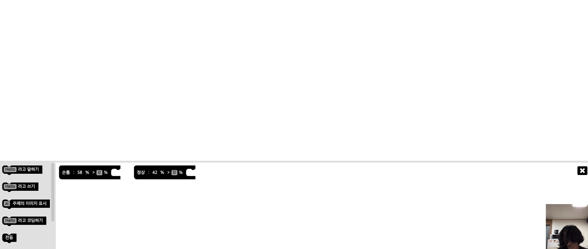
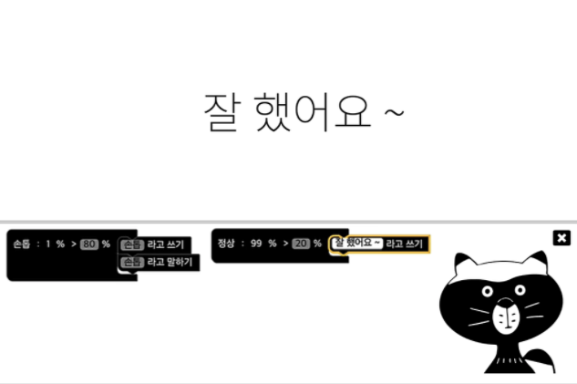

# 머신러닝1 - 2

## 머신러닝 머신
- 사례를 먼저 살펴보자!
    - 손톱 냠냠 -> 그 손 당장 내려놔!
    - 손톱 노 냠냠 -> 칭찬 칭찬
    - [머신 러닝 머신!!](http://ml-app.yah.ac/)

- 사이트가 개꿀이다! 블럭 코딩이 가능함.. 잘만들었다!!
    

    
    
    

## 애플리케이션? 프로그램?
- 같은 것을 가르키는 다른 표현
- 애플리케이션은 '응용', 어떤 부품들을 응용해서 만든 것
    - 우리는 머신러닝 '모델'을 이용해 만든 '프로그램' -> 머신러닝 애플리케이션

